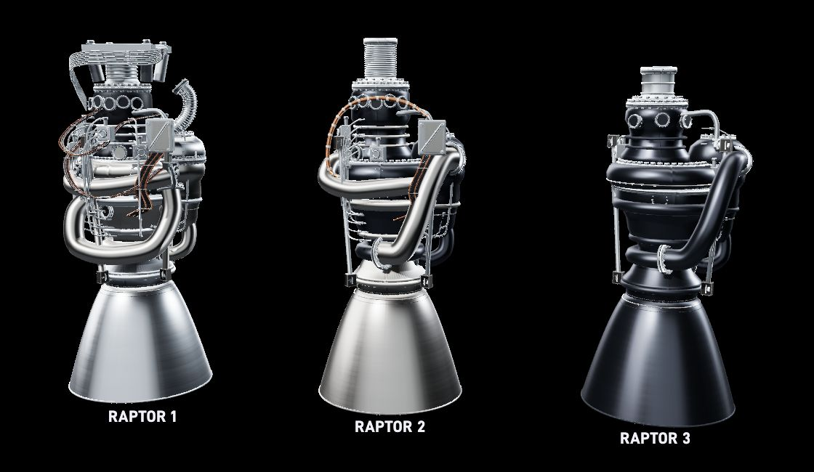

# Raptor

An interactive 3D study of three generations of SpaceX Raptor engines.

Orbit the assemblies, explore their components, and unfold the relationships between them. Compare all three generations in a single view, from Raptor 1's exposed pipework to Raptor 3's integrated exterior.

- Full 360° orbit, close inspection, and perspective or orthographic views.
- Independent controls for assembly separation and component spread.
- Surface, cutaway, and internal study modes.
- Searchable component atlas, isolation, and individual part transforms.
- Procedural metal finishes, studio lighting, and instanced geometry.
- Three.js with WebGPU and a WebGL 2 fallback.

|              | Modeled elements | Component groups |
| ------------ | ---------------: | ---------------: |
| **Raptor 1** |            8,068 |               64 |
| **Raptor 2** |            5,777 |               55 |
| **Raptor 3** |            4,008 |               46 |

An independent visual reconstruction based on public SpaceX photographs. Hidden components and exploded arrangements are illustrative; these models are not official CAD or a verified inventory of engine parts.

[MIT licensed](LICENSE). Bundled D-DIN fonts retain their [SIL Open Font License](public/fonts/d-din/COPYING.txt).
